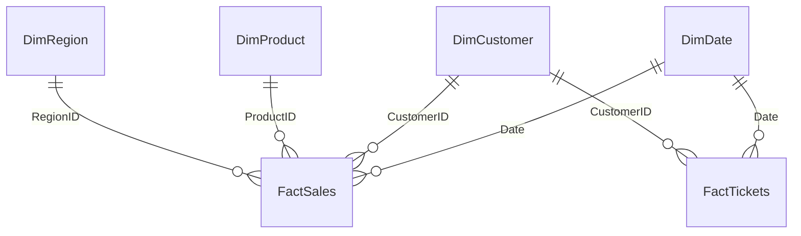

```mermaid
erDiagram
  DimDate ||--o{ FactSales : "Date"
  DimCustomer ||--o{ FactSales : "CustomerID"
  DimProduct ||--o{ FactSales : "ProductID"
  DimRegion ||--o{ FactSales : "RegionID"
  DimDate ||--o{ FactTickets : "Date"
  DimCustomer ||--o{ FactTickets : "CustomerID"
```
